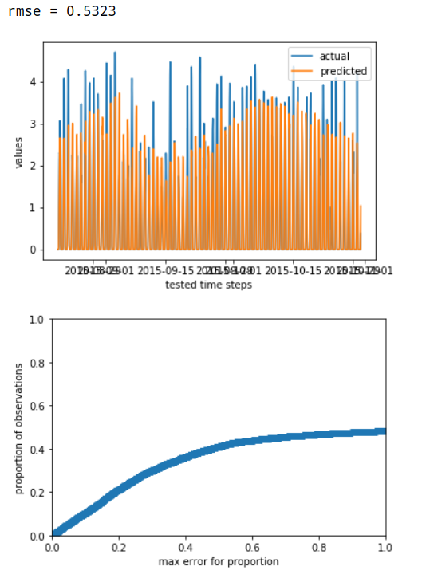

# timetomodel

Time series forecasting is a modern data science & engineering challenge.

We noticed that these two worlds, data science and engineering of time series forecasting, are not very compatible. Often, work from the data scientist has to be re-implemented by engineers to be used in production. 

`timetomodel` was created to change that. It describes the data treatment of a model, and also automates common data treatment tasks like building data for training and testing.

As a *data scientist*, experiment with a model in your notebook. Load data from static files (e.g. CSV) and try out lags, regressors and so on. Compare plots and mean square errors of the models you developed.

As an *engineer*, take over the model description and use it in your production code. Often, this would entail not much more than changing the data source (e.g from CSV to a column in the database).

`timetomodel` is supposed to wrap around any fit/predict type model, e.g. from statsmodels or scikit-learn (some work needed here to ensure support).

## Features

Here are some features for both data scientists and engineers to enjoy:

* Describe how to load data for outcome and regressor variables. Load from Pandas objects, CSV files, Pandas pickles or databases via SQLAlchemy.
* Create train & test data, including lags.
* Timezone awareness support.
* Custom data transformations, after loading (e.g. to remove duplicate) or only for forecasting (e.g. to apply a BoxCox transformation).
* Evaluate a model by RMSE, and plot the cumulative error.
* Support for creating rolling forecasts.

## Installation

``pip install timetomodel``

## Example

Here is an example where we describe a solar time series problem, and use ``statsmodels.OLS``, a linear regression model, to forecast one hour ahead:

    import pandas as pd
    import pytz
    from datetime import datetime, timedelta
    from statsmodels.api import OLS
    from timetomodel import speccing, ModelState, create_fitted_model, evaluate_models
    from timetomodel.transforming import BoxCoxTransformation
    from timetomodel.forecasting import make_rolling_forecasts

    data_start = datetime(2015, 3, 1, tzinfo=pytz.utc)
    data_end = datetime(2015, 10, 31, tzinfo=pytz.utc)
    
    #### Solar model - 1h ahead  ####

    # spec outcome variable
    solar_outcome_var_spec = speccing.CSVFileSeriesSpecs(
        file_path="data.csv",
        time_column="datetime",
        value_column="solar_power",
        name="solar power",
        feature_transformation=BoxCoxTransformation(lambda2=0.1)
    )
    # spec regressor variable
    regressor_spec_1h = speccing.CSVFileSeriesSpecs(
        file_path="data.csv",
        time_column="datetime",
        value_column="irradiation_forecast1h",
        name="irradiation forecast",
        feature_transformation=BoxCoxTransformation(lambda2=0.1)
    )
    # spec whole model treatment
    solar_model1h_specs = speccing.ModelSpecs(
        outcome_var=solar_outcome_var_spec,
        model=OLS,
        frequency=timedelta(minutes=15),
        horizon=timedelta(hours=1),
        lags=[lag * 96 for lag in range(1, 8)],  # 7 days (data has daily seasonality)
        regressors=[regressor_spec_1h],
        start_of_training=data_start + timedelta(days=30),
        end_of_testing=data_end,
        ratio_training_testing_data=2/3,
        remodel_frequency=timedelta(days=14)  # re-train model every two weeks
    )

    solar_model1h = create_fitted_model(solar_model1h_specs, "Linear Regression Solar Horizon 1h")
    # solar_model_1h is now an OLS model object which can be pickled and re-used.
    # With the solar_model1h_specs in hand, your production code could always re-train a new one,
    # if the model has become outdated. 
    
    # For data scientists: evaluate model
    evaluate_models(m1=ModelState(solar_model1h, solar_model1h_specs))

    
    # For engineers a): Change data sources to use database (hinted)
    solar_model1h_specs.outcome_var = speccing.DBSeriesSpecs(query=...)
    solar_model1h_specs.regressors[0] = speccing.DBSeriesSpecs(query=...)
    
    # For engineers b): Use model to make forecasts for an hour
    forecasts, model_state = make_rolling_forecasts(
        start=datetime(2015, 11, 1, tzinfo=pytz.utc),
        end=datetime(2015, 11, 1, 1, tzinfo=pytz.utc),
        model_specs=solar_model1h_specs
    )
    # model_state might have re-trained a new model automatically, by honoring the remodel_frequency

## Developers: Getting Started

### Dependencies using Anaconda

* Install Anaconda for Python3.6+
* Make a virtual environment: `conda create --name timetomodel-venv python=3.6`
* Activate it: `source activate timetomodel-venv` (or `activate timetomodel-venv` for Windows)
* Install dependencies by running setup: `python setup.py develop`
* Run tests: `pytest` or `python -m pytest tests/`

`timetomodel` also works fine if you are not using anaconda, but it is nice - give it a try :)

## Glossary

Here is a short list of terms we have been using at Seita so far and would like to keep using in this way:

Term                | Meaning
---                 | ---
Training            | A time interval with known outcomes, regressors and lag variables, which is used to fit the forecast model.
Testing             | A time interval with known outcomes, regressors and lag variables, which is used to test the accuracy of the fitted model. Prevents overfitting.
Training/test ratio | Usually, a single time interval is selected for training and testing, which is split into two parts. The training/test ratio determines where to make this split (the first part is used for training, the last part is used for testing).
Start of training   | Index of the first timeslot on which the model is trained.
End of testing      | Index of the last timeslot on which the model is tested.
Outcome             | The dependent variable, often referred to as `y` (or `yhat` when the outcome is a forecast).
Lag                 | A duration `L` indicating dependency of the outcome `y(t)` on an earlier outcome `y(t-L)` (lags indicate an autoregressive model)
Regressor           | An independent external variable, often referred to as `x`.
Horizon				| The duration between the timeslot at which a forecast is made and the timeslot which is forecast. The horizons are usually fixed for an application. 
Timeslot			| A time interval within a time series with a certain resolution (e.g. 15 minutes, see below). We index timeslots by their start time.
Resolution			| The distance between timeslots used in the application (called "frequency" in pandas dataframes).
Time window			| All timeslots between some start (including) and end time (excluding).
Rolling forecast	| Shorthand for rolling-horizon forecast. Its time window refers to the forecasted time (i.e. the time at which you made the forecast plus the horizon). 
Forecasts			| Shorthand for fixed-horizon forecast.  
Forecast			| Forecast for a single timeslot made during another timeslot.

